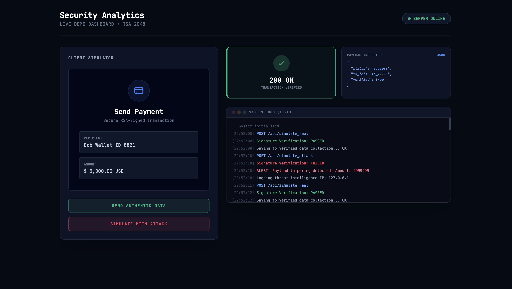

# 🛡️ Fake Data Prevention System
### Secure Transaction Pipeline using RSA-2048 & JWT (RS256)

> **"Data integrity is not about hiding the message, but guaranteeing it hasn't changed."**

---

## 📖 Project Overview
This project is a cybersecurity demonstration engineered to prevent **Man-in-the-Middle (MITM)** attacks and **Fake Data Injection** in web applications. 

Unlike simple encryption, this system utilizes **Digital Signatures (RS256)** to ensure **Data Integrity** and **Non-Repudiation**. It features a "Cyber-Ops" style dashboard that simulates real-time financial transactions, allows users to trigger simulated attacks, and logs forensic "Threat Intelligence" data to a MongoDB audit trail.

---

## 📸 Interface Preview

---

## 🚀 Key Features

### 🔐 Cryptographic Security
* **RSA-2048 Asymmetric Encryption:** Generates a secure Public/Private key pair for signing data.
* **JSON Web Tokens (JWT):** Encapsulates the payload and signature in a standardized, transportable format.
* **RS256 Algorithm:** Uses SHA-256 hashing + RSA encryption to create unforgeable signatures.

### ⚔️ Attack Simulation
* **Real-time MITM Vector:** Simulates an attacker intercepting a token and modifying the payload (e.g., changing $5,000 to $9,999,999).
* **Instant Rejection:** The server detects the signature mismatch immediately and returns a `403 Forbidden` status.

### 🕵️‍♂️ Threat Intelligence & Logging
* **MongoDB Audit Log:** Stores every transaction in two collections: `verified_data` (clean) and `security_alerts` (attacks).
* **Forensic Capture:** Logs the attacker's **IP Address**, **User-Agent** (Device/Browser), and exact timestamp for security analysis.

---

## 🛠️ Technology Stack

| Component | Technology | Usage |
| :--- | :--- | :--- |
| **Backend** | Python 3 + Flask | REST API & Logic Handling |
| **Security** | PyJWT + Cryptography | Token Signing & Key Generation |
| **Database** | MongoDB | Storing Logs & Threat Intel |
| **Frontend** | HTML5 + CSS | "Cyber-Ops" User Interface |
| **Environment** | Virtualenv (venv) | Dependency Isolation |
